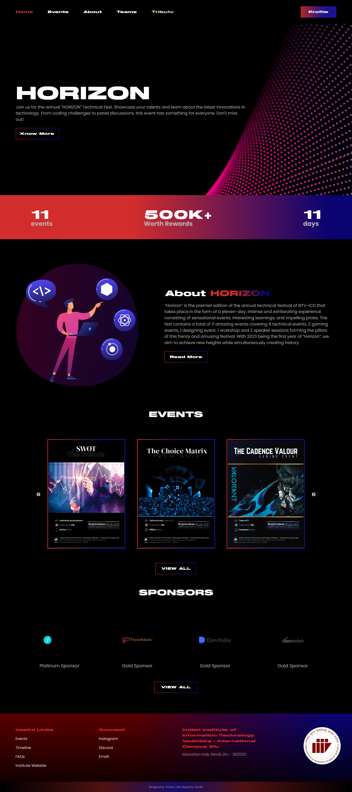

# HORIZON Technical Festival Website (Frontend)


## Table of Contents

- [Introduction](#introduction)
- [Demo](#demo)
- [Technologies Used](#technologies-used)
- [Getting Started](#getting-started)
- [Usage](#usage)
- [Contributing](#contributing)
- [Backend Repository](#backend-repository)

## Introduction

This repository contains the frontend source code for the HORIZON Technical Festival website developed for IIIT Vadodara - ICD. The website serves as a platform to provide information about the technical festival, including event details, registration, schedules, and more. The frontend is built using React.js and utilizes various libraries and components for the user interface.

## Demo

You can access the live version of the website at [http://horizon-iiitvicd.in/](http://horizon-iiitvicd.in/)



## Technologies Used

- React.js
- HTML5
- CSS3
- JavaScript
- React Frontend Libraries

## Getting Started

To get a local copy of the frontend up and running on your machine, follow these steps:

1. Clone the frontend repository:

```bash
git clone https://github.com/Hrishubh/HORIZON-TechFest-Website-FRONTEND.git
```

2. Change into the frontend directory:

```bash
cd HORIZON-TechFest-Website-FRONTEND
```

3. Install frontend dependencies:

```bash
npm install
```

4. Start the development server:

```bash
npm start
```

## Usage

The website is designed to be easy to navigate and intuitive to use. Users can explore the various sections to find information about events, speakers, and schedules. Event registration can be done by following the provided links on the registration page.

Feel free to customize the content and design according to the specific requirements of the festival.

## Contributing

If you would like to contribute to the development of the frontend, you are welcome to submit pull requests. Before making significant changes, please open an issue to discuss the proposed changes.

## Backend Repository

The backend code for this project is hosted on GitHub at: <br> https://github.com/Hrishubh/HORIZON-TechFest-Website-BACKEND
